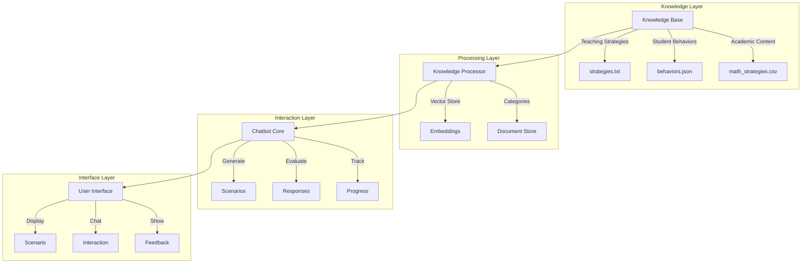
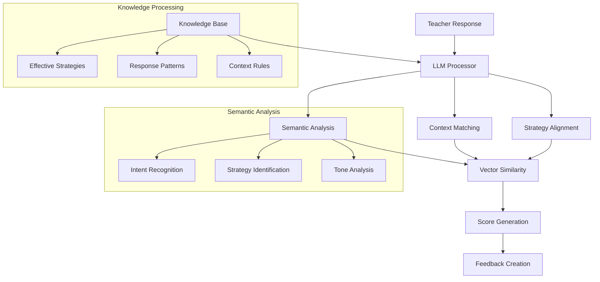
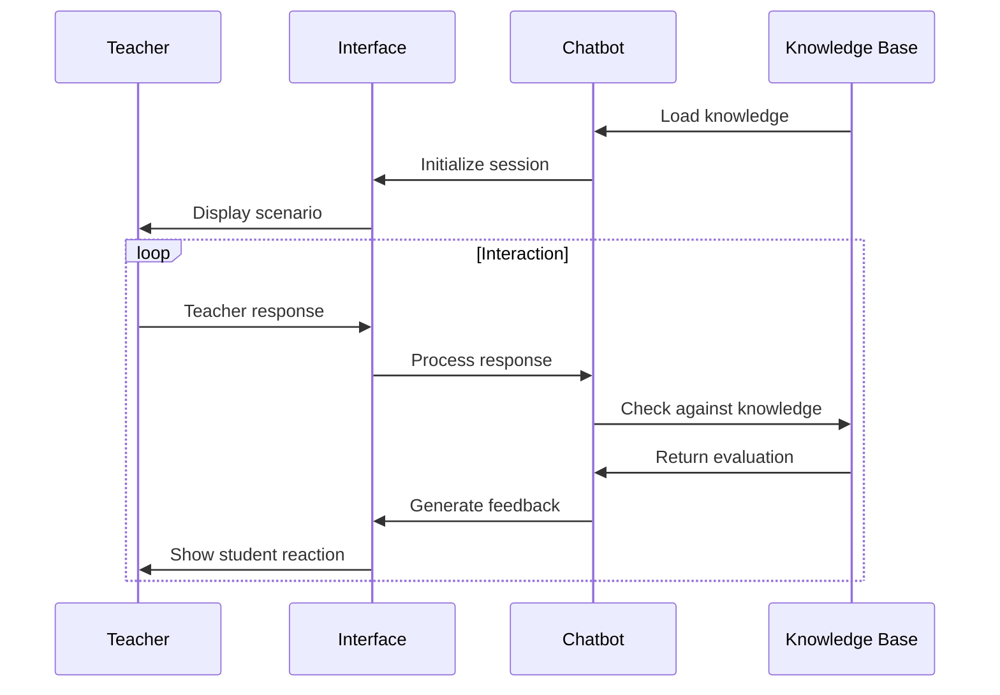

# Teacher Training Simulator 🎓

An AI-powered second-grade student simulator for teacher training, designed to help teachers practice their responses to various classroom scenarios.

## Overview

This simulator creates realistic classroom scenarios and provides immediate feedback on teaching strategies. It uses natural language processing and a knowledge base of educational best practices to evaluate teacher responses and simulate student reactions.

## Key Features

### 1. Scenario Generation
- Creates contextual teaching scenarios
- Considers multiple factors:
  - Time of day (morning, after lunch, late afternoon)
  - Subject matter (math, reading)
  - Student learning styles (visual, auditory, kinesthetic)
  - Behavioral triggers
  - Student states

### 2. Knowledge Management
The system processes and stores teaching knowledge from various sources:
- Teaching strategies
- Student behaviors
- Classroom management techniques
- Subject-specific content
- Learning style adaptations
- Behavioral interventions

Supported file formats:
- PDF Documents (.pdf)
- Word Documents (.docx)
- Text Files (.txt)
- Markdown Files (.md)
- JSON Files (.json)
- YAML Files (.yml)
- CSV Files (.csv)

### 3. Response Evaluation
Evaluates teacher responses across four dimensions:
1. Time-appropriate strategies (20%)
2. Learning style alignment (20%)
3. Behavioral management (30%)
4. Subject-specific support (30%)

### 4. Student Simulation
- Generates contextual student reactions
- Simulates different learning styles
- Models emotional states and engagement levels
- Provides behavioral feedback

## Technical Architecture

### Components

1. `TeacherTrainingChatbot`
   - Core simulation engine
   - Manages scenarios and evaluations
   - Handles student personality and state

2. `KnowledgeManager`
   - Processes teaching resources
   - Manages vector embeddings
   - Handles similarity search

3. `KnowledgeStore`
   - Persistent storage for processed knowledge
   - Vector database for semantic search
   - Document metadata management

4. `TerminalInterface`
   - User interaction handling
   - Display formatting
   - Session management

### Data Flow

1. Knowledge Processing:
   ```
   Raw Files → Extraction → Chunking → Embedding → Vector Store
   ```

2. Scenario Generation:
   ```
   Context Selection → State Generation → Scenario Assembly
   ```

3. Response Evaluation:
   ```
   Teacher Input → Strategy Matching → Multi-dimensional Scoring → Feedback Generation
   ```

## Recommended LLMs

The teacher training simulator is designed to work with various Language Learning Models (LLMs). Here are recommended open-source, local LLMs that work well with this system:

### Why These Models for Educational Chatbots?

Educational chatbots have specific requirements that make certain LLMs more suitable:
1. **Context Understanding**: Must maintain coherent dialogue about educational concepts
2. **Consistent Persona**: Need to maintain a consistent student personality
3. **Real-time Response**: Quick inference for natural conversation flow
4. **Domain Knowledge**: Understanding of educational terminology and concepts
5. **Resource Efficiency**: Ability to run locally on standard hardware

### Primary Recommendation: Mistral
- **Model**: Mistral 7B
- **Why**: Excellent balance of performance and resource requirements
- **Use Cases**: Main response evaluation, student simulation, scenario generation
- **Requirements**: ~16GB RAM
- **Strengths for Chatbots**:
  - Strong dialogue management capabilities
  - Excellent context retention across conversations
  - Good at role-playing (crucial for student simulation)
  - Efficient token processing for quick responses
  - Built-in educational domain knowledge

### Alternative Options:

1. **Llama 2**
   - Models: 7B or 13B variants
   - Good for: Complex teaching strategy evaluation
   - Requirements: 16-24GB RAM
   - **Chatbot Advantages**:
     - Superior instruction following
     - Strong multi-turn conversation abilities
     - Excellent at maintaining consistent personas
     - High-quality educational content generation
     - Well-tested in production environments

2. **BLOOMZ**
   - Models: BLOOMZ-7B1
   - Good for: Multilingual capabilities
   - Requirements: ~16GB RAM
   - **Chatbot Advantages**:
     - Excellent for diverse student populations
     - Strong cross-cultural understanding
     - Good at handling educational terminology
     - Natural conversational flow in multiple languages
     - Consistent personality across languages

3. **Phi-2**
   - Model: Phi-2 (2.7B parameters)
   - Good for: Lightweight deployments
   - Requirements: ~6GB RAM
   - **Chatbot Advantages**:
     - Very fast response generation
     - Good at concise, focused answers
     - Strong performance on educational tasks
     - Efficient context processing
     - Low latency for real-time interactions

4. **TinyLlama**
   - Model: TinyLlama-1.1B
   - Good for: Resource-constrained environments
   - Requirements: ~4GB RAM
   - **Chatbot Advantages**:
     - Ultra-fast inference
     - Good at short, focused interactions
     - Efficient memory usage
     - Suitable for rapid back-and-forth dialogue
     - Works well on basic hardware

### Embedding Models
For semantic search and knowledge retrieval, the system uses:
- **all-MiniLM-L6-v2**: Lightweight sentence transformer model
- Purpose: Generates embeddings for teaching strategies and responses
- Requirements: ~1GB RAM
- Performance: Excellent for semantic similarity tasks
- **Chatbot Benefits**:
  - Fast retrieval of relevant teaching strategies
  - Accurate semantic matching for response evaluation
  - Efficient memory usage alongside main LLM
  - Good at understanding paraphrased student questions
  - Helps maintain conversation coherence

### Deployment Recommendations:

1. **High-Performance Setup** (Best for complex scenarios):
   - Primary: Mistral 7B
   - Embedding: all-MiniLM-L6-v2
   - Total RAM Required: ~18GB
   - Ideal for: Full-featured teaching simulations with complex student behaviors

2. **Balanced Setup** (Good for most use cases):
   - Primary: Phi-2
   - Embedding: all-MiniLM-L6-v2
   - Total RAM Required: ~8GB
   - Ideal for: Standard teaching scenarios with good response times

3. **Lightweight Setup** (Basic functionality):
   - Primary: TinyLlama-1.1B
   - Embedding: all-MiniLM-L6-v2
   - Total RAM Required: ~6GB
   - Ideal for: Basic teaching interactions and rapid prototyping

### Model Quantization Options
All recommended models support various quantization levels:
- **GGUF Format**: 4-bit, 5-bit, and 8-bit quantization available
- **Memory Reduction**: Up to 75% reduction in RAM requirements
- **Speed Impact**: Minimal impact on response quality
- **Recommendation**: Start with 4-bit quantization for optimal balance

All models can be downloaded and run locally using [Ollama](https://ollama.ai/) or [llama.cpp](https://github.com/ggerganov/llama.cpp).

## Installation

```bash
# Clone the repository
git clone https://github.com/yourusername/teacher-training-simulator.git

# Install dependencies
pip install -r requirements.txt
```

## Usage

```bash
# Run the simulator
python terminal_app.py
```

## Knowledge Base Structure

```
knowledge_base/
├── documents/           # Original files
│   ├── teaching/       # Teaching strategies
│   ├── behavior/       # Student behaviors
│   └── content/        # Subject content
│
└── processed/          # Processed data
    ├── knowledge.db    # Vector store
    └── metadata.json   # File information
```

## Contributing

1. Fork the repository
2. Create your feature branch (`git checkout -b feature/AmazingFeature`)
3. Commit your changes (`git commit -m 'Add some AmazingFeature'`)
4. Push to the branch (`git push origin feature/AmazingFeature`)
5. Open a Pull Request

## License

This project is licensed under the MIT License - see the LICENSE file for details.

## System Architecture



## Core Components

### 1. Knowledge Base
- **Teaching Strategies**: Pedagogical approaches and interventions
- **Student Behaviors**: Common behavioral patterns and responses
- **Academic Content**: Subject-specific challenges and solutions

### 2. Scenario Generation
```python
Scenario = {
    "subject": "math/reading",
    "time_of_day": "morning/after lunch/late afternoon",
    "student_context": {
        "learning_style": "visual/auditory/kinesthetic",
        "attention_span": 0.0-1.0,
        "social_confidence": 0.0-1.0,
        "seating": "front/middle/back row",
        "peer_interactions": "group/solo/distracted/shy"
    },
    "behavioral_context": {
        "type": "attention/frustration",
        "trigger": "specific event",
        "manifestation": "observable behavior"
    }
}
```

### 3. Response Evaluation
The system evaluates teacher responses based on four key criteria:

1. **Time-Appropriate Strategies** (20%)
   - Morning: structured start, clear expectations
   - After lunch: movement breaks, energy management
   - Late afternoon: short tasks, varied activities

2. **Learning Style Alignment** (20%)
   - Visual: show, draw, look at
   - Auditory: tell, listen, discuss
   - Kinesthetic: try, move, build

3. **Behavioral Management** (30%)
   - Attention: focus strategies, engagement techniques
   - Frustration: confidence building, support approaches

4. **Subject-Specific Support** (30%)
   - Math: step-by-step, manipulatives, visualization
   - Reading: phonics, comprehension strategies, guided practice

## Teacher Response Evaluation System

### Overview
The system uses a combination of LLM-based semantic understanding and rule-based scoring to evaluate teacher responses:
- Semantic similarity with known effective strategies
- Context-aware response evaluation
- Dynamic learning from the knowledge base
- Adaptive feedback generation

### Evaluation Architecture



### LLM-Based Evaluation Process

1. **Semantic Understanding**
```python
def evaluate_semantic_similarity(response: str, context: dict) -> float:
    """
    Use LLM to understand the semantic meaning of teacher's response
    and compare it with known effective strategies.
    """
    # Encode teacher's response
    response_embedding = embedding_model.encode(response)
    
    # Get relevant strategies from knowledge base
    relevant_strategies = knowledge_base.get_strategies(
        subject=context["subject"],
        behavior=context["behavioral_context"]["type"],
        learning_style=context["student_context"]["learning_style"]
    )
    
    # Calculate semantic similarity
    similarities = []
    for strategy in relevant_strategies:
        strategy_embedding = embedding_model.encode(strategy["text"])
        similarity = cosine_similarity(response_embedding, strategy_embedding)
        similarities.append(similarity * strategy["effectiveness"])
    
    return max(similarities)
```

2. **Context Analysis**
```python
def analyze_context_alignment(response: str, context: dict) -> dict:
    """
    Use LLM to analyze how well the response aligns with the
    specific teaching context.
    """
    prompt = f"""
    Context:
    - Subject: {context['subject']}
    - Student Learning Style: {context['student_context']['learning_style']}
    - Behavior Type: {context['behavioral_context']['type']}
    - Time of Day: {context['time_of_day']}
    
    Teacher's Response: "{response}"
    
    Analyze how well this response addresses:
    1. Subject-specific needs
    2. Learning style alignment
    3. Behavioral management
    4. Time-appropriate strategy
    """
    
    analysis = llm.generate(prompt)
    return parse_llm_analysis(analysis)
```

3. **Strategy Identification**
```python
def identify_teaching_strategies(response: str) -> list:
    """
    Use LLM to identify specific teaching strategies used in the response.
    """
    prompt = f"""
    Identify teaching strategies in: "{response}"
    Consider:
    - Instructional techniques
    - Behavioral management
    - Student engagement
    - Emotional support
    """
    
    strategies = llm.generate(prompt)
    return extract_strategies(strategies)
```

### Comprehensive Evaluation Example

```python
Input Scenario:
{
    "subject": "math",
    "topic": "two-digit addition",
    "student_context": {
        "learning_style": "visual",
        "attention_span": 0.4,
        "current_state": "frustrated"
    }
}

Teacher Response:
"I see you're having trouble with this problem. Let's try something different.
I'll draw out the numbers using base-10 blocks on the board, so you can see
how regrouping works. Would you like to help me draw them?"

LLM Evaluation:
{
    "semantic_similarity": 0.85,  # High match with known effective strategies
    
    "context_alignment": {
        "subject_specific": 0.9,  # Strong math visualization
        "learning_style": 0.95,   # Excellent visual approach
        "behavioral": 0.8,        # Good frustration management
        "timing": 0.75           # Appropriate pacing
    },
    
    "identified_strategies": [
        {
            "type": "visualization",
            "effectiveness": 0.9,
            "context_appropriateness": 0.95
        },
        {
            "type": "student_engagement",
            "effectiveness": 0.85,
            "context_appropriateness": 0.8
        },
        {
            "type": "scaffolding",
            "effectiveness": 0.9,
            "context_appropriateness": 0.9
        }
    ],
    
    "overall_score": 0.88,
    
    "feedback": {
        "strengths": [
            "Excellent use of visual representation",
            "Good recognition of student frustration",
            "Effective engagement through participation"
        ],
        "suggestions": [
            "Consider adding explicit praise for effort",
            "Could incorporate previous successes reference"
        ]
    }
}
```

### Dynamic Learning

The system improves over time by:
1. Recording successful teaching strategies
2. Analyzing patterns in effective responses
3. Updating the knowledge base with new examples
4. Refining evaluation criteria based on outcomes

```python
def update_knowledge_base(response: str, effectiveness: float):
    """
    Add successful strategies to knowledge base for future reference.
    """
    if effectiveness > 0.8:
        new_strategy = {
            "text": response,
            "effectiveness": effectiveness,
            "context": current_context,
            "outcomes": student_reactions
        }
        knowledge_base.add_strategy(new_strategy)
```

## Workflow



## Usage Example

1. **Scenario Generation**:
```
Time: morning. Students are generally alert but may need time to settle.

Student Profile:
- Learning style: visual
- Seating: back row
- Peer interaction: easily distracted by peers
- Current challenges: number sense, staying focused

Situation:
During math class, while working on two-digit addition, 
the student is fidgeting after struggling with regrouping.
```

2. **Teacher Response**:
```
"Let's try this together. We can use these base-10 blocks to see how 
regrouping works. Watch as I show you step by step."
```

3. **Evaluation**:
```
Score: 0.9
✓ Good use of morning appropriate strategy
✓ Response matches visual learning style
✓ Appropriate behavioral support
✓ Good math-specific support
```

## File Structure
```
teacher_training_simulator/
├── app.py                 # Streamlit interface
├── chatbot.py            # Core chatbot logic
├── knowledge_processor.py # Knowledge processing
├── knowledge_base/       # Knowledge files
│   ├── teaching_strategies.txt
│   ├── student_behaviors.json
│   └── math_strategies.csv
└── processed_knowledge/   # Vector store
```

## Setup and Running

1. Install dependencies:
```bash
pip install -r requirements.txt
```

2. Run the application:
```bash
streamlit run app.py
```

## Contributing

Feel free to contribute by:
1. Adding more teaching scenarios
2. Enhancing evaluation criteria
3. Improving student responses
4. Adding new subjects/behaviors