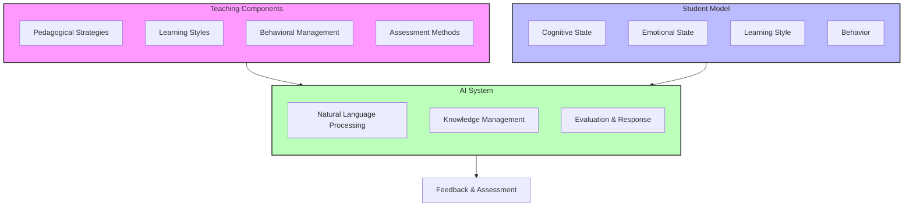
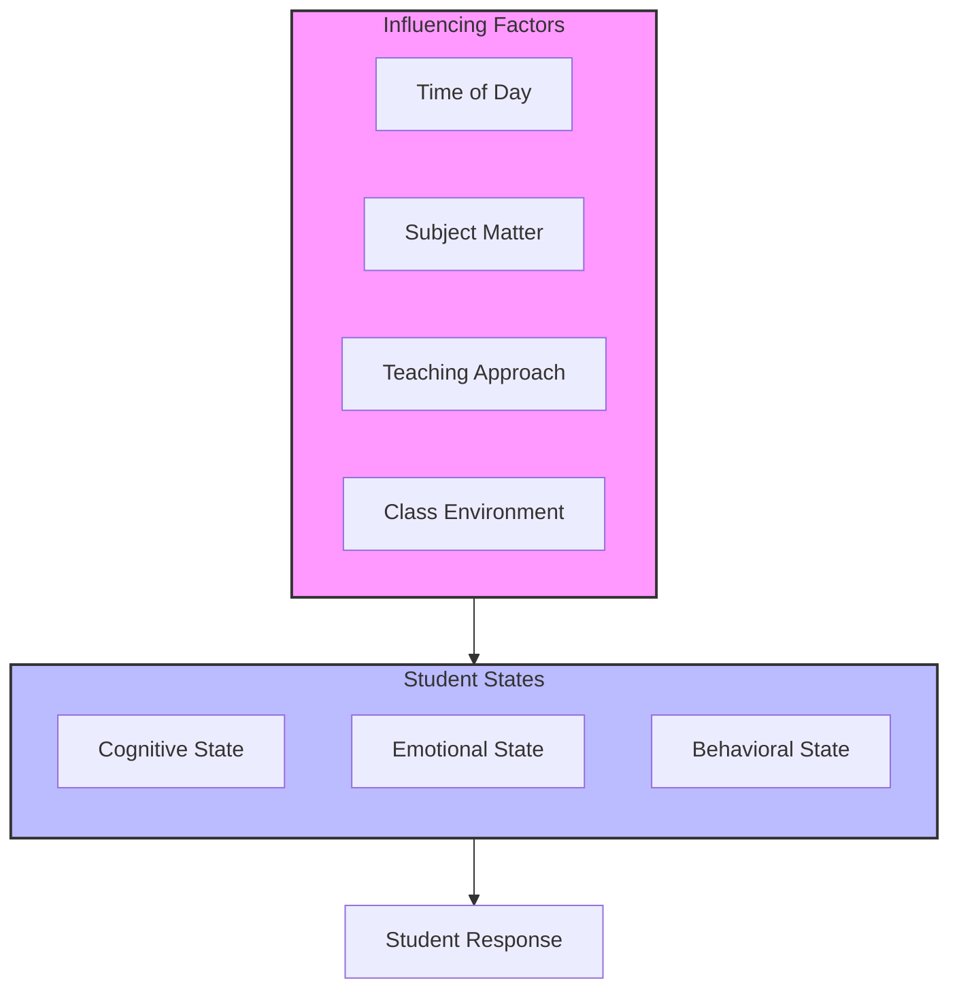
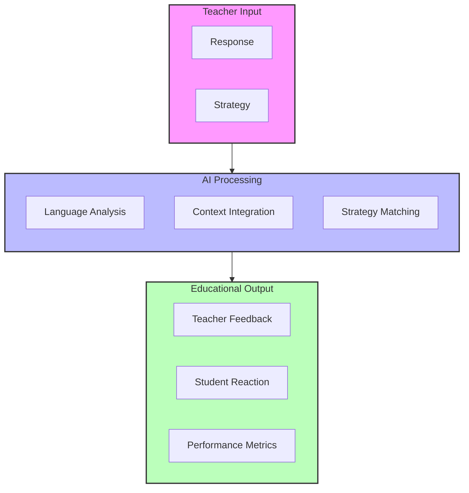
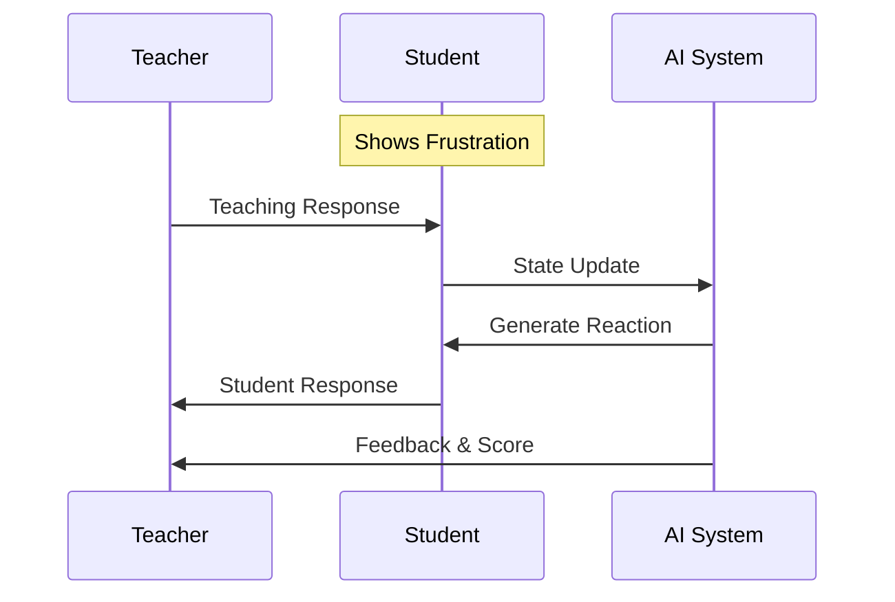

# UTTA Development

An AI-powered educational simulation system designed to help teachers develop and refine their teaching strategies through interactive practice with a simulated second-grade student.

## Educational Framework



### 1. Pedagogical Components

#### Teaching Strategies Assessment
- **Time-based Strategies** (20%)
  - Morning: Structured activities, clear expectations
  - After Lunch: Movement integration, energy management
  - Late Afternoon: Short tasks, varied activities

- **Learning Style Alignment** (20%)
  ```mermaid
  graph LR
      V[Visual] --> Show[Show & Demonstrate]
      A[Auditory] --> Tell[Tell & Discuss]
      K[Kinesthetic] --> Do[Do & Practice]
      
      style V fill:#f9f
      style A fill:#bbf
      style K fill:#bfb
  ```

- **Behavioral Management** (30%)
  - Attention strategies
  - Frustration management
  - Engagement techniques
  - Positive reinforcement

- **Subject-Specific Support** (30%)
  - Math: Concrete to abstract progression
  - Reading: Phonics and comprehension strategies
  - Cross-subject integration

### 2. Student Simulation Model



#### Student State Components
1. **Cognitive State**
   - Understanding level (0-1.0)
   - Attention span
   - Subject comprehension

2. **Emotional State**
   - Engagement level
   - Frustration tolerance
   - Confidence

3. **Behavioral Manifestations**
   - Physical indicators
   - Verbal responses
   - Interaction patterns

### 3. AI Integration



### 4. Learning Scenarios

Example Scenario Structure:
```
Time: Morning
Context: Math Class
Topic: Two-digit Addition
Student State:
- Learning Style: Visual
- Current Challenge: Number Sense
- Behavioral State: Frustrated
```

#### Scenario Progression


## Technical Implementation

### Core Components

1. **AI Agent**
   - Natural language processing
   - Context-aware responses
   - Real-time evaluation

2. **Knowledge Management**
   - Teaching strategies database
   - Behavioral patterns
   - Response templates

3. **Evaluation System**
   - Multi-dimensional scoring
   - Strategy effectiveness
   - Learning progression

## Usage Guide

### For Teachers

1. **Getting Started**
   ```bash
   python terminal_app.py
   ```

2. **Session Flow**
   - Profile setup
   - Scenario selection
   - Interactive teaching
   - Performance review

3. **Improvement Strategies**
   - Review feedback
   - Try different approaches
   - Track progress

### For Developers

1. **Installation**
   ```bash
   git clone https://github.com/yourusername/teacher-training-simulator.git
   pip install -r requirements.txt
   ```

2. **Development Setup**
   - Configure LLM
   - Set up knowledge base
   - Test scenarios

## Contributing

We welcome contributions in:
1. Teaching scenarios
2. Evaluation criteria
3. Student responses
4. Subject matter

## License

This project is licensed under the MIT License - see the LICENSE file for details.