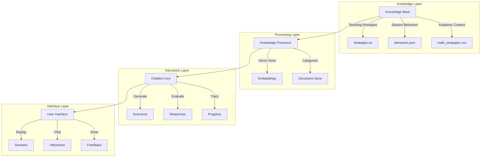
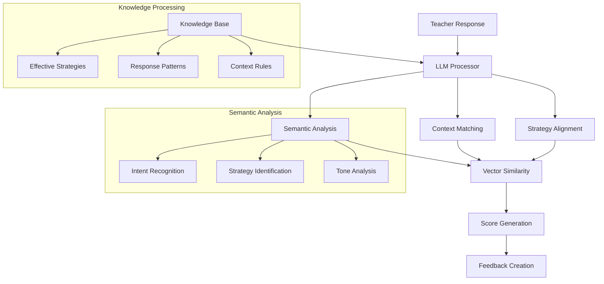
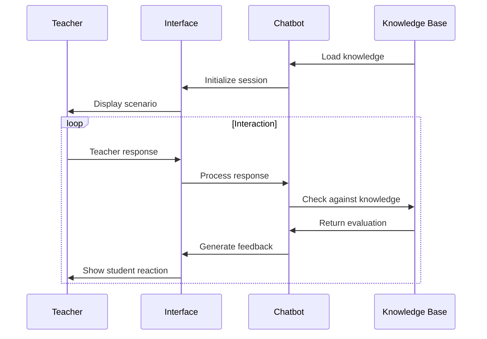

# Teacher Training Simulator 🎓

A second-grade student simulator for teacher training, designed to help teachers practice handling various classroom scenarios.

## System Architecture



## Core Components

### 1. Knowledge Base
- **Teaching Strategies**: Pedagogical approaches and interventions
- **Student Behaviors**: Common behavioral patterns and responses
- **Academic Content**: Subject-specific challenges and solutions

### 2. Scenario Generation
```python
Scenario = {
    "subject": "math/reading",
    "time_of_day": "morning/after lunch/late afternoon",
    "student_context": {
        "learning_style": "visual/auditory/kinesthetic",
        "attention_span": 0.0-1.0,
        "social_confidence": 0.0-1.0,
        "seating": "front/middle/back row",
        "peer_interactions": "group/solo/distracted/shy"
    },
    "behavioral_context": {
        "type": "attention/frustration",
        "trigger": "specific event",
        "manifestation": "observable behavior"
    }
}
```

### 3. Response Evaluation
The system evaluates teacher responses based on four key criteria:

1. **Time-Appropriate Strategies** (20%)
   - Morning: structured start, clear expectations
   - After lunch: movement breaks, energy management
   - Late afternoon: short tasks, varied activities

2. **Learning Style Alignment** (20%)
   - Visual: show, draw, look at
   - Auditory: tell, listen, discuss
   - Kinesthetic: try, move, build

3. **Behavioral Management** (30%)
   - Attention: focus strategies, engagement techniques
   - Frustration: confidence building, support approaches

4. **Subject-Specific Support** (30%)
   - Math: step-by-step, manipulatives, visualization
   - Reading: phonics, comprehension strategies, guided practice

## Teacher Response Evaluation System

### Overview
The system uses a combination of LLM-based semantic understanding and rule-based scoring to evaluate teacher responses:
- Semantic similarity with known effective strategies
- Context-aware response evaluation
- Dynamic learning from the knowledge base
- Adaptive feedback generation

### Evaluation Architecture



### LLM-Based Evaluation Process

1. **Semantic Understanding**
```python
def evaluate_semantic_similarity(response: str, context: dict) -> float:
    """
    Use LLM to understand the semantic meaning of teacher's response
    and compare it with known effective strategies.
    """
    # Encode teacher's response
    response_embedding = embedding_model.encode(response)
    
    # Get relevant strategies from knowledge base
    relevant_strategies = knowledge_base.get_strategies(
        subject=context["subject"],
        behavior=context["behavioral_context"]["type"],
        learning_style=context["student_context"]["learning_style"]
    )
    
    # Calculate semantic similarity
    similarities = []
    for strategy in relevant_strategies:
        strategy_embedding = embedding_model.encode(strategy["text"])
        similarity = cosine_similarity(response_embedding, strategy_embedding)
        similarities.append(similarity * strategy["effectiveness"])
    
    return max(similarities)
```

2. **Context Analysis**
```python
def analyze_context_alignment(response: str, context: dict) -> dict:
    """
    Use LLM to analyze how well the response aligns with the
    specific teaching context.
    """
    prompt = f"""
    Context:
    - Subject: {context['subject']}
    - Student Learning Style: {context['student_context']['learning_style']}
    - Behavior Type: {context['behavioral_context']['type']}
    - Time of Day: {context['time_of_day']}
    
    Teacher's Response: "{response}"
    
    Analyze how well this response addresses:
    1. Subject-specific needs
    2. Learning style alignment
    3. Behavioral management
    4. Time-appropriate strategy
    """
    
    analysis = llm.generate(prompt)
    return parse_llm_analysis(analysis)
```

3. **Strategy Identification**
```python
def identify_teaching_strategies(response: str) -> list:
    """
    Use LLM to identify specific teaching strategies used in the response.
    """
    prompt = f"""
    Identify teaching strategies in: "{response}"
    Consider:
    - Instructional techniques
    - Behavioral management
    - Student engagement
    - Emotional support
    """
    
    strategies = llm.generate(prompt)
    return extract_strategies(strategies)
```

### Comprehensive Evaluation Example

```python
Input Scenario:
{
    "subject": "math",
    "topic": "two-digit addition",
    "student_context": {
        "learning_style": "visual",
        "attention_span": 0.4,
        "current_state": "frustrated"
    }
}

Teacher Response:
"I see you're having trouble with this problem. Let's try something different.
I'll draw out the numbers using base-10 blocks on the board, so you can see
how regrouping works. Would you like to help me draw them?"

LLM Evaluation:
{
    "semantic_similarity": 0.85,  # High match with known effective strategies
    
    "context_alignment": {
        "subject_specific": 0.9,  # Strong math visualization
        "learning_style": 0.95,   # Excellent visual approach
        "behavioral": 0.8,        # Good frustration management
        "timing": 0.75           # Appropriate pacing
    },
    
    "identified_strategies": [
        {
            "type": "visualization",
            "effectiveness": 0.9,
            "context_appropriateness": 0.95
        },
        {
            "type": "student_engagement",
            "effectiveness": 0.85,
            "context_appropriateness": 0.8
        },
        {
            "type": "scaffolding",
            "effectiveness": 0.9,
            "context_appropriateness": 0.9
        }
    ],
    
    "overall_score": 0.88,
    
    "feedback": {
        "strengths": [
            "Excellent use of visual representation",
            "Good recognition of student frustration",
            "Effective engagement through participation"
        ],
        "suggestions": [
            "Consider adding explicit praise for effort",
            "Could incorporate previous successes reference"
        ]
    }
}
```

### Dynamic Learning

The system improves over time by:
1. Recording successful teaching strategies
2. Analyzing patterns in effective responses
3. Updating the knowledge base with new examples
4. Refining evaluation criteria based on outcomes

```python
def update_knowledge_base(response: str, effectiveness: float):
    """
    Add successful strategies to knowledge base for future reference.
    """
    if effectiveness > 0.8:
        new_strategy = {
            "text": response,
            "effectiveness": effectiveness,
            "context": current_context,
            "outcomes": student_reactions
        }
        knowledge_base.add_strategy(new_strategy)
```

## Workflow



## Usage Example

1. **Scenario Generation**:
```
Time: morning. Students are generally alert but may need time to settle.

Student Profile:
- Learning style: visual
- Seating: back row
- Peer interaction: easily distracted by peers
- Current challenges: number sense, staying focused

Situation:
During math class, while working on two-digit addition, 
the student is fidgeting after struggling with regrouping.
```

2. **Teacher Response**:
```
"Let's try this together. We can use these base-10 blocks to see how 
regrouping works. Watch as I show you step by step."
```

3. **Evaluation**:
```
Score: 0.9
✓ Good use of morning appropriate strategy
✓ Response matches visual learning style
✓ Appropriate behavioral support
✓ Good math-specific support
```

## File Structure
```
teacher_training_simulator/
├── app.py                 # Streamlit interface
├── chatbot.py            # Core chatbot logic
├── knowledge_processor.py # Knowledge processing
├── knowledge_base/       # Knowledge files
│   ├── teaching_strategies.txt
│   ├── student_behaviors.json
│   └── math_strategies.csv
└── processed_knowledge/   # Vector store
```

## Setup and Running

1. Install dependencies:
```bash
pip install -r requirements.txt
```

2. Run the application:
```bash
streamlit run app.py
```

## Contributing

Feel free to contribute by:
1. Adding more teaching scenarios
2. Enhancing evaluation criteria
3. Improving student responses
4. Adding new subjects/behaviors