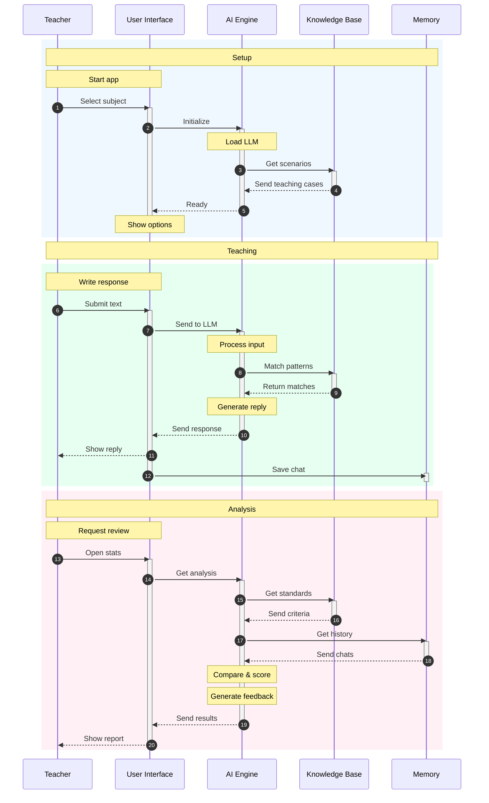

# UTTA Development (Phase One - Chatbot)

An AI-powered educational simulation chatbot designed to help teachers develop and refine their teaching strategies through interactive text-based practice with a simulated second-grade student.

## System Overview



The application works through four main components that interact seamlessly to provide a realistic teaching simulation:

1. **User Interface**: Handles teacher interactions through both terminal and web interfaces
2. **AI Engine**: Processes inputs and generates contextual responses using LLM technology
3. **Knowledge Base**: Stores educational content, teaching standards, and response patterns
4. **Memory**: Maintains chat history, session states, and interaction records

## Application Components

### 1. Core AI Engine

The AI Engine is the core of our application, handling:
- Natural language processing of teacher inputs
- Context management for conversations
- LLM-based response generation
- Response evaluation and feedback


### 2. Knowledge Management System

The Knowledge Management System handles:
- Storage and retrieval of teaching scenarios
- Vector-based similarity search
- Response pattern matching
- Performance analytics


### 3. User Interface System

The User Interface System provides:
- Interactive chat interface
- Real-time feedback display
- Progress tracking and visualization
- Session management


## Component Details

### AI Engine Configuration
```python
# Example AI engine configuration
config = {
    "model": "llama-2-7b-chat",
    "context_length": 2048,
    "temperature": 0.7,
    "response_cache": True
}
```

### Knowledge Base Structure
```python
# Example knowledge base entry
scenario = {
    "context": "Math Class",
    "difficulty": "intermediate",
    "student_state": {
        "learning_style": "visual",
        "attention": 0.8,
        "frustration": 0.3
    }
}
```

### Interface Features
```python
# Example interface configuration
ui_config = {
    "chat_history": 10,
    "feedback_delay": 0.5,
    "auto_suggestions": True,
    "progress_tracking": True
}
```

## Getting Started

### For Teachers
```bash
# Terminal interface
python terminal_app.py

# Web interface
streamlit run web_app.py
```

### For Developers
```bash
# Installation
git clone https://github.com/yourusername/teacher-training-simulator.git
pip install -r requirements.txt

# Development
python -m pytest tests/
python run_dev_server.py
```

## Contributing

### AI Development
- Model integration and tuning
- Prompt engineering
- Response generation
- Evaluation metrics

### Data Management
- Scenario development
- Knowledge base expansion
- Analytics implementation
- Pattern recognition

### Web Development
- Interface improvements
- Feature implementation
- Performance optimization
- User experience enhancement

## License

This project is licensed under the MIT License - see the LICENSE file for details.